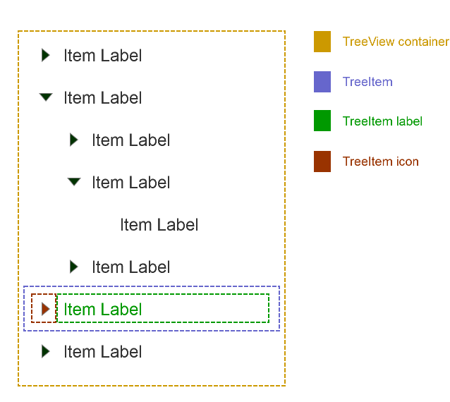
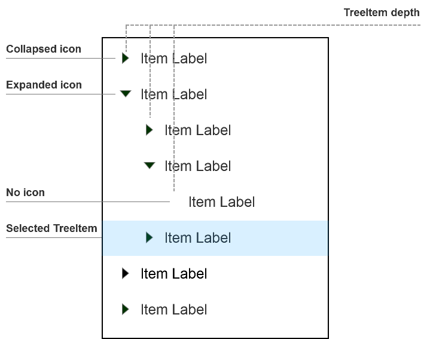
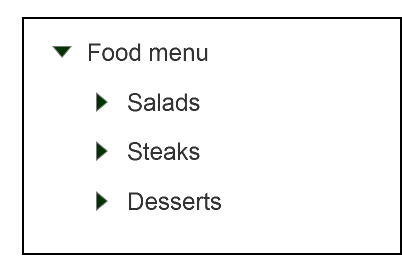
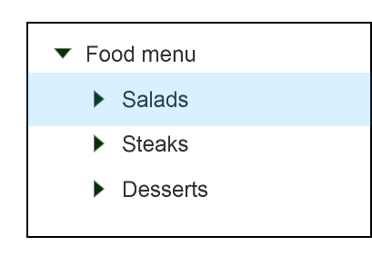
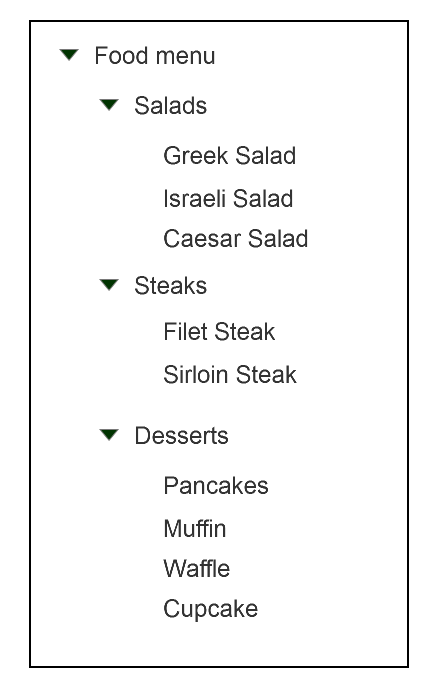
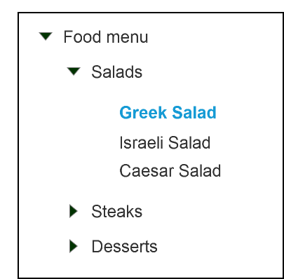

# TreeView Component

**TreeView** is a component that creates a hierarchical display of data. Example uses of TreeViews include a corporate hierarchy, a directory structure, a documentation center, and so on.

## Component Structure and States

### Elements



* **TreeView** is a container of **TreeItems** (nodes) ordered hierarchically.  

* **TreeItem** is composed of a **TreeItem Label**, and an optional **TreeItem Icon** if the node has children.  

* **TreeItem Icon** is used to expand and collapse its particular node.

### Element States



* Each **TreeItem** has selected, focused and expanded states.

* Each **TreeItem** has a specified depth (positive digit signifying how deep it is nested in the tree).

* Each **TreeItem Icon** has an expanded and collapsed states, as well as empty option.

## API

### Component Props

## API

| Name | Type | Default | Required | Description |
| -- | -- | -- | -- | -- |
| id | string | null | no | Unique identifier, relevant for a standalone component |
| disabled | boolean | false | no | Whether the TreeView responds to events or not |
| onSelectItem | React.EventHandler  | () => {} | no | Callback to be invoked when an item is selected. |
| onFocusItem  | React.EventHandler  | () => {} | no | Callback to be invoked when an item is focused.  |
| onExpandItem  | React.EventHandler  | () => {} | no | Callback to be invoked when an item is expanded.  |
| selectedItem | TreeItemData |  | no | Refers to the currently selected data item. |
| focusedItem  | TreeItemData |  | no | Refers to the currently focused data item. |
| expandedItem  | TreeItemData |  | no | Refers to the currently expanded data item(s). |
| aria-label | string | null | no | aria attribute, relevant for a standalone component |
| aria-labelledby | string | null | no | aria attribute, relevant for a standalone component |
| aria-describedby | string | null | no | aria attribute, relevant for a standalone component |


The following props should be placed in a store interface since they will need to be passed from higher order components.

| Name | Type | Default | Required | Description |
| -- | -- | -- | -- | -- |
| dataSource | Array[TreeItemData] | [] | no | The TreeItemData is of type '*string \| object \| symbol*'. The dataSource receives an array and the component uses the renderItem function to render the items in the array in order.
| dataMapper | (item) -> ({value, string, disabled}) | {} | no | Maps fields from the TreeItemData to the field used by the renderItem function |
| renderItem | See RenderItem contract | null | default function | no | The renderItem function receives a TreeItemData and then decides how to render it.

**Note** for the default TreeView renderItem function that if both datasource and children are present then the children are rendered first and then the dataSource items.

### RenderItem Contract

renderItem is a function with the following arguments:

| Name | Type | Default value | Description |
| -- | -- | -- | -- |
| item | object or Divider | {} | Remapped SelectionItem to be rendered by the ItemRenderer |
| selected | boolean | false | Whether the item is selected |
| focused | boolean | false  | Whether the item is focused by keyboard navigation |
| expanded | boolean | false | Whether the node is in its expanded state |

renderItem must put `data-value` attribute on the root node of any selectable item. Items without the `data-value`
attribute will be displayed, but won't be selectable.

`item` is an object created by remapping the original TreeItem using `dataMapper`. Therefore, the
`item` object has always consistent structure, regardless of the structure of the `dataSource.`

If the original TreeItem was string, the resulting `item` object will put this value into
the `value` and `displayText` fields.

### Default RenderItem

If the item doesn't have the `value` field, it is rendered without the `data-value`.

If the item is the Divider symbol, it will be renderer as a divider. (!)

In the default ItemRenderer, the (remapped) item object has following structure:

| Name | Type | Default value | Required | Description |
| -- | -- | -- | -- | -- |
| id | string | automatically generated | no | Used in order to provide a key for assistive technologies to locate the focused option |
| value | string | null | no | The unique value id (for selectable items) |
| displayText | string | '' | no | Text content of the item |
| hidden | boolean | false | no | Whether ths item appears in the list |
| disabled | boolean | false | no | Whether an item is enabled for selection or not |

### Methods

| Name | Parameters | Description |
| -- | -- | --
| collapse | item: Object (required) | Collapses all nodes under a provided node |
| collapseAll | none | Collapses all the tree nodes |
| expand | item: TreeItem (required) | Expands all nodes under a provided node |
| expandAll | boolean deep (default) or shallow | Expands all the tree nodes |
| selectItem | item: Object (required) | Selects an item in the three |

### Code Examples

##### Sample data for the examples

```tsx
const treeData: TreeItemData[] = [
    { label: 'Food Menu', children: [
        { label: 'Salads', children: [
            { label: 'Greek Salad' },
            { label: 'Israeli Salad' },
            { label: 'Caesar Salad' }
        ]},
        { label: 'Steaks', children: [
            { label: 'Filet Steak' },
            { label: 'Sirloin Steak' }
        ]},
        { label: 'Desserts', children: [
            { label: 'Pancakes' },
            { label: 'Muffin' },
            { label: 'Waffle' },
            { label: 'Cupcake' }
        ]}
    ]}
];
```

##### Example views

* Renders a TreeView

```tsx
<TreeView dataSource={treeData} />
```

* Renders a TreeView with the ability to select an item.

```tsx
const parentState = {
  selectedItem: Object;
};

function onSelectItem(selectedItem) {
  this.state.selectedItem = selectedItem;
}

<TreeView dataSource={treeData} selectedItem={this.state.selectedItem} onSelectItem={this.onSelectItem.bind(this)} />
```

## Style API

TreeView supports the following style states for each node (note that some styles will appear in conjunction). 

#### Example 1: all second-level nodes are collapsed



#### Example 2: all second-level nodes are collapsed, 'Salads' hovered



#### Example 3: all second-level nodes are expanded



#### Example 4: 'Salad' node is expanded, 'Greek Salad' is selected



### Component parts (pseudo-elements)

The TreeView component exposes the following internal structure via Stylable:

| selector        | description | custom states            |
| --------- | ----------------- | --------------- |
| .root | The root container of the **TreeView** component |  |
| .root::item | The root class for the **TreeItem**. | :selected <br> :focused <br> :expanded <br> :depth(n) |
| .root::item::icon | The style for the **TreeItem Icon** which appears only if child nodes are available. |  |
| .root::item::title | The style for the **TreeItem Label**. |  |

### Style Code Examples

```css
.TreeView::item {
    background-color: white;
}

.TreeView::item:focused {
    border: 1px solid lightblue;
}

.TreeView::item:selected {
    background-color: navy;
    color: white;
}

.TreeView::item:selected::icon {
    transform: rotate
}

.TreeView::item:depth(2):selected::title {
    color: blue;
}
```
## Accessibility

### Roles

* Root role - tree
* Child node role - treeitem
* Group of children under a node - group

    Example:

    ```html
    <ul role="tree" aria-labelledby="tree_label">
        <li role="treeitem" aria-expanded="false">
        <span>Root Node</span>
        <ul role="group">
            <li role="treeitem">Sub Node</li>
            <li role="treeitem">Sub Node</li>
        </ul>
    </ul>
    ```

### Aria Attributes

* The node with tree role supports the text content attributes.
* Set aria-expanded to false if node is not expanded, otherwise set aria-expanded to true. End nodes do not have this attribute.
* aria-selected is set to true only on the selected node.

### Focus

Tabindex and aria-activedescendant solution postponed for the moment.

## Input Handling

### Keyboard Navigation

* Home -> highlights ths first item in the TreeView
* End -> highlights the last item in the TreeView
* Enter -> Selects current highlighted item (does not expand it though)
* Up arrow -> highlights previous item
* Down arrow -> highlights next item
* Left arrow ->
  * if child then highlights parent
  * if parent then collapses it
* Right arrow ->
  * expands item and highlights it
  * if item was already expanded then highlights the first child
  