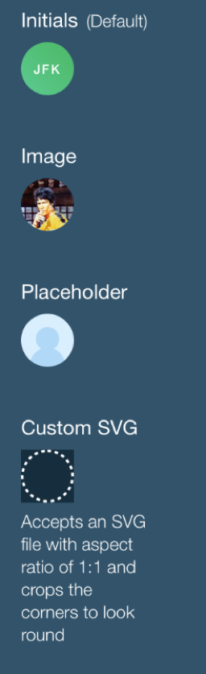

# Avatar

Avatar is a type of element that visually represents a user, either as an image, icon or initials.
<br><br>

## Elements

Elements are "container" and content, which could be classified to either "text", "image" or "icon"

## API

#### Component Props

| name      | type                             | defaultValue | isRequired | description                                                            |
|:----------|:---------------------------------|:-------------|:-----------|:-----------------------------------------------------------------------|
| name      | string                           |              |            | The name of the avatar user. Initials will be generated from the name  |
| imgProps  | Omit<HTMLImageAttributes, 'alt'> |              |            | the source url to load image from                                      |
| placeholder      | JSX Element                      |              |            | an SVG icon component                                                  |
| text      | string                      |              |            | raw text to display as content                                                  |
| title     | string                           | 0            |            | the `title` attribute to put on the root. Defaults to `name` prop      |
| ariaLabel | string                           | 0            |            | the `aria-label` attribute to put on the root. Defaults to `name` prop |
| initialsLimit | number 2 | 3 | 2 | | Sets a letter limit to generated initials.

## General Behavior

this component will display content based on the props provided:

* If `imgProps` is provided (and successfully loaded), it will display an image as content with the provided properties.

* If `text` | `name` is provided it will display the string.
  * If `text` is not provided but `name` is, then the displayed string would be initials that are generated from the name.
* If an element is provided in `placeholder` it will display it.

### Image Fallback
If image fails to load, the component will display either `placeholder` or `text` or `name` initials, in that order.
This alternative will also be shown while image in loading state.

### Name To Initials
By default if `text` is not provided, then initials text would be generated from the `name`.
Initials is limited by default to 3 letters.
Examples:

<br/> John Doe --> JD
<br/> John H. Doe --> JHD
<br/> John Hurley Stanley Kubrik Doe --> JHD
<br/> john doe --> JD

* If `initialsLimit` is set to 2, then first and last name parts are used.
* Generated initials will always be uppercase.

## Technical Considerations

The `alt` property is omitted from `imgProps` interface. `name` prop will be used as `alt` instead.<br>

<br>additional behaviors (such as tooltip, dropdown, focus, click, etc.) should be implemented in wrappers.

### React Code Example

**Example 1:**

```jsx
//code example goes here
import * as React from 'react';
import { Avatar } from 'wix-ui-core/Avatar';
import { AvatarIcon } from 'my-icons/AvatarIcon';
import style from './style.st.css'; // link to Style file - see examples of style files below

export class ComponentsDemo extends React.Component<{}, {}>{

    render() {
        return (
            <div>
                <Avatar
                    className={style.avatar}
                    name="John H. Doe"
                    text="Doe"
                    imgProps={{
                        srcset="elva-fairy-320w.jpg 320w, elva-fairy-800w.jpg 800w"
                        sizes="(max-width: 320px) 280px, 800px"
                        src="elva-fairy-800w.jpg"
                    }}
                    placeholder={<AvatarIcon/>}
                    />
            </div>
        )
    }
}
```

## Style API

### Selectors (pseudo-elements)

| selector          | description                        | type | children pseudo-states |
|:------------------|:-----------------------------------|:-----|:-----------------------|
| root       | Allows styling the background      |      |                        |
| ::content | Allows styling the content container |      |                        |

### States
| state        | description                        | type |
|:-------------|:-----------------------------------|:-----|
| imgLoaded   | true when the img was loaded     | boolean  |
| contentType  | Which content type is currently displayed | enum(image,placeholder,text) |

### Style Code Example

```css
:import {
  -st-from: './components/avatar';
  -st-default: Avatar;
}

.root {
}
.avatar {
  -st-extends: Avatar;
}
.avatar:contentType(text)::content {
  color: red;
}
```

## Accessibility & Keyboard Navigation

The root will have `tabIndex = 0` by default meaning it will be focusable and part of the keyboard navigation flow.<br>
If no  `ariaLabel` prop is provided `aria-label={this.props.name}` will be put on the root<br>
