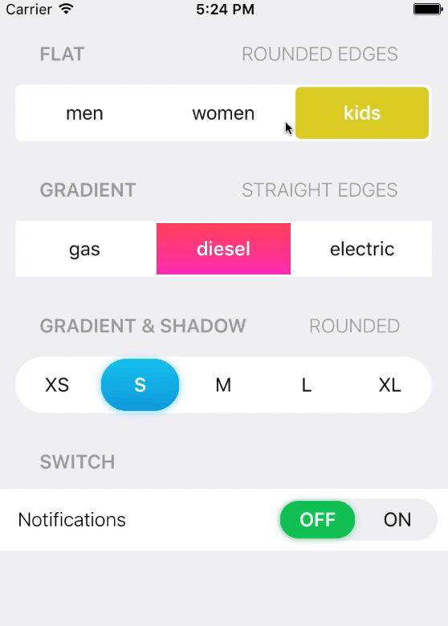

**Table of Contents**

- [Description](#description)

- [Elements](#elements)

- [API](#api)

- [States](#states-(if-applicable))

- [Accessibility](#accessibility)

- [Behavior](#behavior)
  - [Validation](validation)
  - [Edge case handling](edge-case-handling)

- [Input Methods](#input-methods)
  - [Keyboard](#keyboard)
  - [Mouse](#mouse)
  - [Touch](#touch)

- [RTL](#rtl)

- [DOM Structure](#dom-structure)

- [Design](#design)

  ​
TBD
component name - segmented control?
error prop & style????
callback structure


## Description

**Segmented Toggle** allows users to choose a single option out of a group. Recommended use is for a small amount of predefined options.





### Elements

This component consists of **container** which is the root of the component and **option** which holds each of the selection options


## API

**SegmentedToggle Props**
| name     | type                                                     | defaultValue | isRequired | description                                                                                 |
|:---------|:---------------------------------------------------------|:-------------|:-----------|:--------------------------------------------------------------------------------------------|
| value    | string                                                   |              |            | sets the selected option of the group. should match the `value` prop of one of the children |
| onChange | (event: React.ChangeEvent<React.SyntheticEvent>) => null | () => {}     |            | event to call when selection change                                                         |
| disabled | boolean                                                  | false        |            | disables all functionality of the component AND toggles non-functional visual state         |
| readOnly | boolean                                                  | false        |            | disables all functionality of the component WITHOUT toggling non-functional visual state    |
| required | boolean                                                  | false        |            | when true, a user cannot submit a form when this component has no selected option    |
| children | Component<IToggleableOption>                                    |              |            | The options to render.         |
| aria-labelledby | string                                                  | false        |            | accessibility feature to provide additional description for screen readers     |


**IToggleableOption Props**
Children of the **SegmentedToggle** component are expected to implement this interface in order for the component to function as expected:

| name     | type      | defaultValue | isRequired | description                                                 |
|:---------|:----------|:-------------|:-----------|:------------------------------------------------------------|
| value    | string    |    true          |            | sets the value of the specific option. Must be unique       |
| checked | boolean   | false        |            | indicates that the option should be shown as selected  |
| disabled | boolean   | false        |            | indicates this option is non selectable and toggles visual state |
| onChange | (event: React.ChangeEvent<React.SyntheticEvent>) => null | () => {}     |            | event to call when selection change
| children | ReactNode | false        |            | The content to render.                                      |


## React Code Example

Basic example using exported `<SimpleToggleOption/>`:

```jsx
import * as React from 'react';
import { SegmentedToggle, SimpleToggleOption } from 'wix-ui-core/SegmentedToggle';
import { EditSVG, TrashSVG} from './my-icons'
import style from './style.st.css';

export class ComponentsDemo extends React.Component<{}, {}>{
    state = {
        selected: 'item1'
    }

    onChange = (event:React.ChangeEvent<React.SyntheticEvent>, value: string): null => {
        this.setState({value})
    }

    render() {
        return (
            <div>
                <SegmentedToggle
                    value={this.state.selected}
                    onChange={this.onChange} 
                >
                    <SimpleToggleOption value='item1'>Raw</SimpleToggleOption>
                    <SimpleToggleOption value='item2'>Blame</SimpleToggleOption>
                    <SimpleToggleOption value='item3'>History</SimpleToggleOption>
                    <SimpleToggleOption value='item4' disabled>{EditSVG}</SimpleToggleOption>
                    <SimpleToggleOption value='item5'>{TrashSVG}</SimpleToggleOption>
                </SegmentedToggle>
                   
            </div>
        )
    }
}
```
Advanced example with custom options:

```jsx
import * as React from 'react';
import { SegmentedToggle, IToggleOption } from 'wix-ui-core/SegmentedToggle';
import style from './style.st.css';
import optionStyle from './optionStyle.st.css';
import { OpenSVG, CloseSVG } from './my-icons'

export interface IMyCustomOption extends IToggleOption {
    icon: React.ReactNode
    onIconClick: React.EventHandler<React.ClickEvent>
    label: string
    onLabelClick: React.EventHandler<React.ClickEvent>
}

const MyCustomOption = (props: IMyCustomOption): React.JSXElement => {
    return (
        <div {...optionStyle('root',{checked: props.checked, disabled: props.disabled}, props)}>
            <span className={optionStyle.icon} 
                onClick={e=>{props.onIconClick(props.value, e); props.onChange(props.value, e)}}>
                    {props.icon}
            </span>
            <span className={optionStyle.icon} 
                onClick={e=>{props.onLabelClick(props.value, e); props.onChange(props.value, e)}}>
                {props.label}
            </span>
        </div>
    )
}

export class ComponentsDemo extends React.Component<{}, {selected: string}>{
    state = {
        selected: 'open'
    }

    onChange = (event:React.ChangeEvent<React.SyntheticEvent>, value: string): null => {
        this.setState({value})
    }

    render() {
        return (
            <div>
                <SegmentedToggle
                    value={this.state.selected}
                >
                    <MyCustomOption
                        value='open'
                        checked={this.state.selected === 'open'}
                        onChange={this.onChange}
                        label='Open'
                        onLabelClick={(val) => console.log('clicked on label ' + val)}
                        icon={OpenSVG}
                        onLabelClick={(val) => console.log('clicked on icon ' + val)}
                    />
                    <MyCustomOption
                        value='close'
                        checked={this.state.selected === 'close'}
                        onChange={this.onChange}
                        label='Close'
                        onLabelClick={(val) => console.log('clicked on label ' + val)}
                        icon={CloseSVG}
                        onLabelClick={(val) => console.log('clicked on icon ' + val)}
                    />
                    
                </SegmentedToggle>
                   
            </div>
        )
    }
}
```

**Style**

## **SimpleToggleOption** States

Since **SegmentedToggle** is merely rendering options, most styling is done on the `option` elements. These are the states available on **SimpleToggleOption**.

| State         | Description                            | Link to design |
|:--------------|:---------------------------------------|:---------------|
| default       | Default component appearance           |                |
| selected      | selected option                        |                |
| disabled      | disabled option                        |                |
| hover         | when hovering over option              |                |
| focus         | the option has focus                   |                |
| focus-visible | the option has focus and visible focus |                |
| pressed       | toggles when the option is pressed     |                |


## Accessibility

TBD role, aria-labels 
**SegmentedToggle** role = "radiogroup"
option role = "radio"

selected option should have `aria-checked=“true”`. all other options should have `aria-checked=“false”.`

roving tabIndex

##### Keyboard

**SegmentedToggle** has a radio group keyboard behavior, meaning after TAB into focus navigation is done via arrow keys. UP or LEFT will SELECT the previous option while DOWN or RIGHT will SELECT next option of the group. TAB will move focus 
##### Focus

**SegmentedToggle** has a radio group focus behavior, meaning focus is put on the selected item. Changing selection causes focus to shift to the new selected item. By default mouse selection causes non visual focus while keyboard selection toggles focus visible visual state.

##### Reference links

> Links to similar ARIA compatible components for reference


### Behavior
**SegmentedToggle** should be viewed as a replacement to a radio group in all aspects and should mimic its "native" counterpart (meaning a group of `<input type="radio" name="..."/>`>) behavior.


#### Validation 
Default validation needs to be addressed, as well as the component behavior when validation is broken.


#### Edge case handling

| Case                                     | Handling                                 |
| ---------------------------------------- | ---------------------------------------- |
| value out of min/max range               | Show error in console and set value to corresponding min/max |
| value out of step (e.g. min=0 / max=20, step=5, value=7) | Show error in console, handle displays on 7. User can increase value (in this case 7 will change to 10) OR decrease value (7 will change to 5) and after that step will work as expected. |


## Input Methods

#### Keyboard

| Keys      | Action                      |
| --------- | --------------------------- |
| tab       | moves to next element       |
| shift+tab | moves to previous element   |
| UP / LEFT      | moves selection & focus to previous option |
| DOWN / RIGHT      | moves selection & focus to next option |
| SPACE      | selects focused option (should only be applicable when no option is currently selected) |


#### Mouse

| Event | Action                | NOTE                     |
| ----- | --------------------- | ------------------------ |
| hover | - |  |
| click | select option         |                          |


#### **Touch**

| Event | Action              | NOTE                    |
| ----- | ------------------- | ----------------------- |
| tap   | select option |  |
| drag  | -                    |                         |


## RTL
TBD
