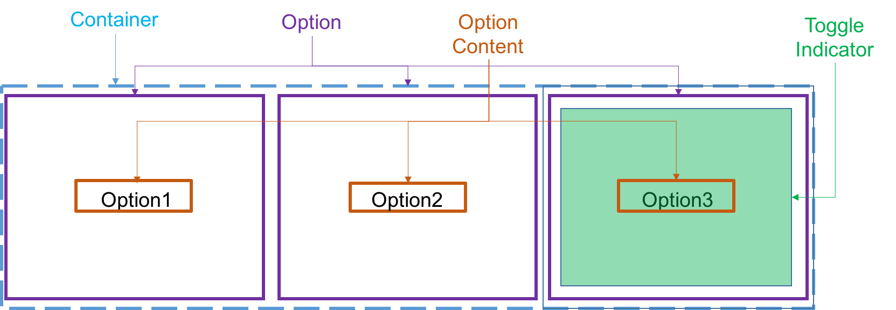

# Segmented Toggle
  ​

## Description

**Segmented Toggle** allows users to choose a single option out of a group. Best applied to use cases where: 
* Only one options applies for the user
* One of the options is always selected


### Elements

This component consists of **container** which is the root of the component, **option** which holds each of the selection options content (children) and **toggle-indicator** that indicates the selected option and shows toggle animation



## API

**SegmentedToggle Props**

| name            | type                                                     | defaultValue | isRequired | description                                                                                 |
|:----------------|:---------------------------------------------------------|:-------------|:-----------|:--------------------------------------------------------------------------------------------|
| value           | string                                                   |             |            | sets the selected option of the group. Should match the `value` prop of one of the children |
| onChange        | (value: string, event: React.ChangeEvent<React.SyntheticEvent>) => null | () => {}     |            | event to call when selection change                                                         |
| disabled        | boolean                                                  | false        |            | disables all functionality of the component AND toggles non-functional visual state         |
| hideToggleIndicator        | boolean                                                  | false        |            | setting `true` will remove the toggle indicator element         |
| readOnly        | boolean                                                  | false        |            | disables all functionality of the component WITHOUT toggling non-functional visual state    |
| rtl????        | boolean                                                  | false        |            | when true, the rendering order of the options change from left-to-right to right-to-left           |
| children        | Component< IToggleableOption >                             |              |            | The options to render.                                                                      |
| ariaLabelledby | string                                                   | false        |            | accessibility feature to provide additional description for screen readers                  |

**IToggleableOption Props**
<br>Children of the **SegmentedToggle** component are expected to implement this interface in order for the component to function as expected:

| name     | type                                                     | defaultValue | isRequired | description                                                      |
|:---------|:---------------------------------------------------------|:-------------|:-----------|:-----------------------------------------------------------------|
| value    | string                                                   | true         |            | sets the value of the specific option. Must be unique            |
| checked  | boolean                                                  | false        |            | indicates that the option should be shown as selected            |
| disabled | boolean                                                  | false        |            | indicates this option is non selectable and toggles visual state |
| onChange | (value: string, event: React.ChangeEvent<React.SyntheticEvent>) => null | () => {}     |            | event to call when selection change                              |
| children | ReactNode                                                | false        |            | The content to render.                                           |


## React Code Example

Basic example using exported `<SimpleToggleOption/>`:

```jsx
import * as React from 'react';
import { SegmentedToggle, SimpleToggleOption } from 'wix-ui-core/SegmentedToggle';
import { EditSVG, TrashSVG} from './my-icons'
import style from './style.st.css';

export class ComponentsDemo extends React.Component<{}, {}>{
    state = {
        selected: 'item1'
    }

    onChange = (event:React.ChangeEvent<React.SyntheticEvent>, value: string): null => {
        this.setState({value})
    }

    render() {
        return (
            <div className={style.toggle}>
                <SegmentedToggle
                    value={this.state.selected}
                    onChange={this.onChange} 
                >
                    <SimpleToggleOption value='item1'>Raw</SimpleToggleOption>
                    <SimpleToggleOption value='item2'>Blame</SimpleToggleOption>
                    <SimpleToggleOption value='item3'>History</SimpleToggleOption>
                    <SimpleToggleOption value='item4' disabled>{EditSVG}</SimpleToggleOption>
                    <SimpleToggleOption value='item5'>{TrashSVG}</SimpleToggleOption>
                </SegmentedToggle>
                   
            </div>
        )
    }
}
```
Advanced example with custom options:

```jsx
import * as React from 'react';
import { SegmentedToggle, IToggleOption } from 'wix-ui-core/SegmentedToggle';
import style from './style.st.css';
import optionStyle from './optionStyle.st.css';
import { OpenSVG, CloseSVG } from './my-icons'

export interface IMyCustomOption extends IToggleOption {
    icon: React.ReactNode
    onIconClick: React.EventHandler<React.ClickEvent>
    label: string
    onLabelClick: React.EventHandler<React.ClickEvent>
}

const MyCustomOption = (props: IMyCustomOption): React.JSXElement => {
    return (
        <div {...optionStyle('root',{checked: props.checked, disabled: props.disabled}, props)}>
            <span className={optionStyle.icon} 
                onClick={e=>{props.onIconClick(props.value, e); props.onChange(props.value, e)}}>
                    {props.icon}
            </span>
            <span className={optionStyle.icon} 
                onClick={e=>{props.onLabelClick(props.value, e); props.onChange(props.value, e)}}>
                {props.label}
            </span>
        </div>
    )
}

export class ComponentsDemo extends React.Component<{}, {selected: string}>{
    state = {
        selected: 'open'
    }

    onChange = (event:React.ChangeEvent<React.SyntheticEvent>, value: string): null => {
        this.setState({value})
    }

    render() {
        return (
            <div className={style.toggle}>
                <SegmentedToggle
                    value={this.state.selected}
                >
                    <MyCustomOption
                        value='open'
                        checked={this.state.selected === 'open'}
                        onChange={this.onChange}
                        label='Open'
                        onLabelClick={(val) => console.log('clicked on label ' + val)}
                        icon={OpenSVG}
                        onLabelClick={(val) => console.log('clicked on icon ' + val)}
                    />
                    <MyCustomOption
                        value='close'
                        checked={this.state.selected === 'close'}
                        onChange={this.onChange}
                        label='Close'
                        onLabelClick={(val) => console.log('clicked on label ' + val)}
                        icon={CloseSVG}
                        onLabelClick={(val) => console.log('clicked on icon ' + val)}
                    />
                    
                </SegmentedToggle>
                   
            </div>
        )
    }
}
```

**Style**

### Subcomponents (pseudo-elements)

| selector    | description                             | type                                | children pseudo-states |
|:------------|:----------------------------------------|:------------------------------------|:-----------------------|
| ::container | contains all options                    | the root of the component           |                        |
| ::option    | wraps each child of **SegmentedToggle** | renders the children of that option |                        |   
| ::toggle-indicator    | overlay element shown over selected option |  |                        |  

## **SimpleToggleOption** States

Since **SegmentedToggle** is merely rendering options, most states relate to `option` elements. These are the states available on **SimpleToggleOption**.

| State         | Description                            | Link to design |
|:--------------|:---------------------------------------|:---------------|
| selected      | selected option                        |                |
| disabled      | disabled option                        |                |
| hover         | when hovering over option              |                |
| focus         | the option has focus                   |                |
| focus-visible | the option has focus and visible focus |                |
| active       | toggles when the option is pressed     |                |


## Accessibility

**SegmentedToggle** role = "radiogroup"
options role = "radio"

selected option should have `aria-checked=“true”`. all other options should have `aria-checked=“false”.`

##### Keyboard

**SegmentedToggle** has a radio group keyboard behavior, meaning after TAB into focus navigation is done via arrow keys. UP or LEFT will SELECT the previous option while DOWN or RIGHT will SELECT next option of the group. TAB will move focus 
##### Focus

**SegmentedToggle** has a radio group focus behavior, meaning focus is put on the selected item. Changing selection causes focus to shift to the new selected item. By default mouse selection causes non visual focus while keyboard selection toggles focus visible visual state.

##### Reference links
[ARIA radio button example](https://www.w3.org/TR/2017/WD-wai-aria-practices-1.1-20170628/examples/radio/radio-1/radio-1.html)


### Behavior
**SegmentedToggle** mostly mimics native radio group (meaning a group of `<input type="radio" name="..."/>`) in behavior. Unlike native radio group, this type of selector must always start with an option selected. `value` property is required to force it, and if it matches none of its the children `value` properties the first option is selected.


#### Validation 
Aside from supplying a simplified usage with `<SimpleToggleOption>` this component doesn't validate that children conform to the required interface. This can lead to unexpected behaviors when using custom option component.  `<SimpleToggleOption>` should suffice most use cases so using it is recommended.

#### Edge case handling


## Input Methods

#### Keyboard

| Keys         | Action                                                                                  |
|:-------------|:----------------------------------------------------------------------------------------|
| tab          | moves to next element                                                                   |
| shift+tab    | moves to previous element                                                               |
| UP / LEFT    | moves selection & focus to previous option                                              |
| DOWN / RIGHT | moves selection & focus to next option                                                  |


#### Mouse

| Event | Action        | NOTE |
|:------|:--------------|:-----|
| hover | -             |      |
| click | select option |      |


#### **Touch**

| Event | Action        | NOTE |
|:------|:--------------|:-----|
| tap   | select option |      |
| drag (toggle-indicator)  | moves the toggle indicator to a different option  |      |


## RTL
TBD


## For discussion
* onChange callback structure
* rtl and how to apply it
