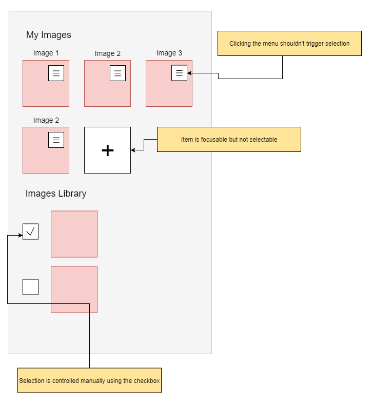

# SelectionList Component Specification

A component which allows the user to take action by choosing an item or multiple items from a list.

* [Selection List Package](#selection-list-package)
* [React Code Examples](#react-code-examples)
  * [Basic Usage](#basic-usage) 
  * [Complex Usage](#complex-usage)
* [Components Contracts](#components-contracts)
  * [SelectionList](#selectionlist) 
  * [SelectableItems](#selectableitems)
  * [SelectableItemProps](#selectableitemprops)
  * [SelectionListAction](#selectionlistaction)
  * [FocusableItemProps](#focusableitemprops)  
* [Accessibility](#accessibility) 
  * [Roles](#roles) 
  * [Aria Attributes](#aria-attributes) 

## Selection List Package

In order to use a selection list, the user should use a composition of several components.
The root component of the composition is the *SelectionList* component that used to provide selection list logic based on the components components within its hierarchy.
The *SelectionList* component hierarchy can be an arbitrary hierarchy of ReactElements, but the selection list logic is defined based on the following components:
* SelectableItems - Used to render selectable items from a datasource, which can be an array of items or a single data item.
* FocusableItem - Used to render a single item that can be focused but **not** selected in the selection list.

## React Code Examples

### Basic Usage

In the following example we'll demonstrate the most basic usage of the SelectionList component, by defining a CountriesList class that represents a single selection list of country names.

```js
export class CountriesList extends React.Component<{countries: Array<string>}> {
    public state = {
        value: [], 
        focusedValue: null, 
        selectionStartValue: null, 
        typeAheadValue: null,
        disabledValues: null
    };

    public render() {
        return (
            <SelectionList
                value={this.state.value}
                focusedValue={this.state.focusedValue}
                selectionStartValue={this.state.selectionStartValue}
                typeAheadValue={this.state.typeAheadValue}
                typeAhead={true}
                onChange={this.handleChange}
            >
                <SelectableItems
                    dataSource={this.props.countries}
                    idFunction={dataItem => dataItem}
                    typeAheadTextFunction={dataItem => dataItem}
                    renderItem={CountryRenderItem}
                />
            </SelectionList>
        );
    }

    private handleChange = ({value, focusedValue, selectionStartValue, typeAheadValue, disabledValues}) => this.setState({value, focusedValue, selectionStartValue, typeAheadValue, disabledValues});
}

const style = require('country-item.st.css');

const CountryRenderItem : React.SFC<SelectableItemProps> = (props) => {
    return (
        <div 
            {...style('root', {selected: props.isSelected, focused: props.isFocused, disabled: props.isDisabled})}}
            onClick={(event) => {
                props.onRequestAction(event);
            }}
        >
            {this.props.dataItem}
        </div>
    )  
};

```

### Complex Usage



```js
export uploadImageButtonId = Symbol('uploadImageButton');

export class ImagesPanel extends React.Component {
    public state = {
        value: [], 
        focusedValue: null, 
        selectionStartValue: null, 
        typeAheadValue: null,
        disabledValues: null
    };

    public render() {
        return (
            <SelectionList
                value={this.state.value}
                focusedValue={this.state.focusedValue}
                selectionStartValue={this.state.selectionStartValue}
                typeAheadValue={this.state.typeAheadValue}
                typeAhead={true}
                onChange={this.handleChange}
                multiple={true}
            >
                <h1>My Images</h1>
                <div class="layout-wrap">
                    <SelectableItems
                        dataSource={this.props.myImages}
                        idFunction={dataItem => dataItem.id}
                        typeAheadTextFunction={dataItem => dataItem.title}
                        renderItem={ImageRenderItem}
                    />
                    <FocusableItem
                        id={uploadImageButtonId}
                        renderItem={(props: FocusableItemProps) => {
                            return (
                                <UploadButton isFocused={props.isFocused}>Upload</UploadButton>
                            )
                        }}
                    />
                </div>
                <h1>Images Library</h1>
                <SelectableItems
                    dataSource={this.props.imagesLibrary}
                    idFunction={dataItem => dataItem.id}
                    renderItem={ImageWithCheckboxRenderItem}
                />
            </SelectionList>
        );
    }

    private handleChange = ({value, focusedValue, selectionStartValue, typeAheadValue, disabledValues}) => this.setState({value, focusedValue, selectionStartValue, typeAheadValue, disabledValues});
}

const ImageRenderItem : React.SFC<SelectableItemProps> = (props) => {
        return (
            <div>
                <div
                    onClick={(event) => {
                        props.onRequestAction(event);    
                    }}
                >
                    <h2>{props.dataItem.imageTitle}</h2>
                    <ImageView
                        src={props.dataItem.imageSrc}
                    />
                </div>
                <ImageMoreActionsButton class="absolute-top-right">
            </div>
        )  
    };
    
const ImageWithCheckboxRenderItem : React.SFC<SelectableItemProps> = (props) => {
    return (
        <div class="layout-horizontal">
            <CheckBox
                onChange={(changeEvent) => {
                    props.onRequestAction(changeEvent.isChecked ? SelectionListAction.AddToSelection : SelectionListAction.RemoveFromSelection);
                }}
            />
            <ImageView
                src={props.dataItem.imageSrc}
            />
        </div>
    )  
};

```

## Components Contracts

### SelectionList

| Name | Type | Default | Required | Description |
| -- | -- | -- | -- | -- |
| value | string \| Array\<string\> \| Symbol \| Array\<Symbol\> | null | no | id/s of the selected item/s |
| focusedValue | string | null | no | id of the focused item |
| selectionStartValue | string | null | no | id of the item that is used for a anchor node in multiple selection when the *shift* key is pressed |
| typeAheadValue | string | null | no | the text that is used for the type ahead logic. |
| disabledValues | string \| Array<string> | null | no | ids of the disabled item/s |
| onChange | (event: ChangeEvent) => void | NOP | no | Triggered when the state of the list is changed. The state of the list consists of selected items, focused item, selection start item, disabled items, type ahead value. These values are provided inside the event structure.
| multiple | boolean | false | no | Whether the selection list supports single or multiple selections. When true, adds aria-multiselectable='true' to the root element.
| orientation | enum | Vertical | no | The orientation is used mostly for assistive technologies. Changing to Horizontal will change the behavior of keyboard navigation and add an aria-orientation attribute to the root with the 'horizontal' value |
| typeAhead | boolean | true | no | Enables keyboard type-ahead |
| children | any | null | no | See explanation about SelectionList components hierarchy |
| disabled | boolean | false | no | Whether the SelectionList responds to events or not |
| readonly | boolean | false | no | Gains tab focus but user cannot change value |
| id | string | null | no | Unique identifier, relevant for a standalone component |
| name | string | null | no | Specifies the name of the input element, relevant for a standalone component |
| tabIndex | number | null | no | Tab order of the element, relevant for a standalone component |
| aria-label | string | null | no | aria attribute, relevant for a standalone component |
| aria-labelledby | string | null | no | aria attribute, relevant for a standalone component |
| aria-describedby | string | null | no | aria attribute, relevant for a standalone component |

### SelectableItems

| Name | Type | Default | Required | Description |
| -- | -- | -- | -- | -- |
| dataSource | any \| Array<any> | null | no | the selectable items data items |
| idFunction | (dataItem: any) => string | none | yes | A function that extracts the ID from the data item |
| typeAheadTextFunction | (dataItem: any) => string | none | yes | A function that extracts the type ahead text from the data item |
| renderItem | React.SFC<SelectableItemProps> | none | yes | A SFC that used for rendering a data item |
| tabIndex | number | none | no | The tab index that the SelectableItems component should put on its inner focused item (if such exists). This property will be auto set by the SelectionList component and its value would be the value of the SelectionList component's tabIndex property |

### SelectableItemProps
| Name | Type | Default | Required | Description |
| -- | -- | -- | -- | -- |
| dataItem | any | none | yes | The data item that should be rendered |
| isSelected | boolean | none | yes | Indicates of whether the data item is selected |
| isFocused | boolean | none | yes | Indicates of whether the data item is focused |
| isDisabled | boolean | none | yes | Indicates of whether the data item is disabled |
| onRequestAction | (action: DomEvent \| SelectionListAction) => void | none | yes | A callback that can be called by the selectable item when it wants to trigger an action in the selection list. This callback receives a single parameter that can be one of the following: **1.** a DomEvent - the selection list will decide how to change its state based on the DomEvent data (e.g. if *CTRL* key is pressed, the selection list will add the item to the selection). **2.** One of the SelectionListAction enum values - the item will instruct the selection list how to change its state.  |

#### SelectionListAction

| Key | Description |
| -- | -- |
| Select | Select the item and clear the rest of the selection (similar to Click) |
| SelectRange | Select items from the selection start to the item (similar to Shift + Click) |
| AddToSelection | Add the item to the selected items set (similar to CTRL + Click when the item is not selected) |
| RemoveFromSelection | Remove the item from the selected items set (similar to CTRL + Click when the item is selected) |
| Disable | Disable the item |
| Enable | Enable the item |

### FocusableItemProps

| Name | Type | Default | Required | Description |
| -- | -- | -- | -- | -- |
| dataItem | any | none | yes | The data item that should be rendered |
| isFocused | boolean | none | yes | Indicates of whether the data item is focused |
| isDisabled | boolean | none | yes | Indicates of whether the data item is disabled |

## Accessibility

Reference [listbox](https://www.w3.org/TR/wai-aria-practices/#Listbox) in w3 draft.

### Roles
* Root Role - listbox (identifies the focusable element that has listbox behaviors and contains listbox options)
* Children role - option (identifies a selectable element)

### Aria Attributes
* aria-selected="true" - Applied to elements with role option that are visually styled as selected to inform assistive technologies that the options are selected. When multiple selections are allowed, this attribute is applied to all selected items (false when not selected).
* aria-orientation="vertical" - Applied on the root element. By default the value should be vertical, so only if the orientation is set horizontal should the value change to "horizontal".
